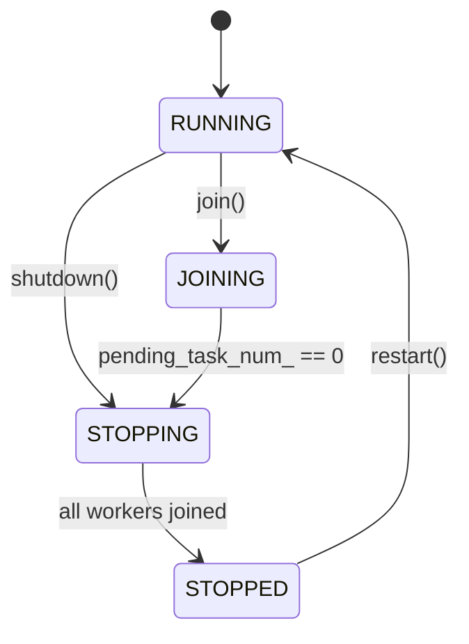
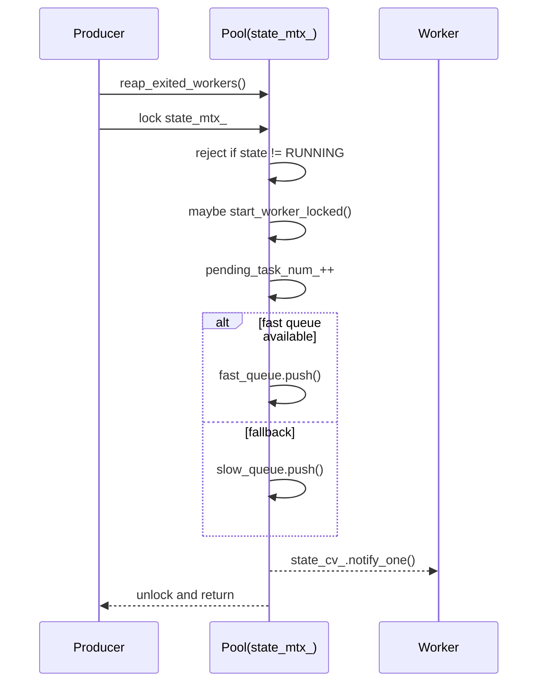
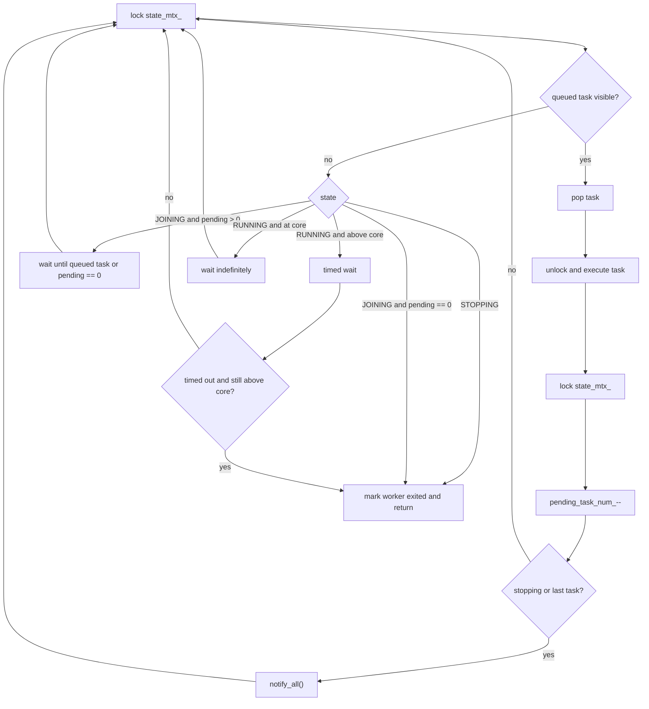
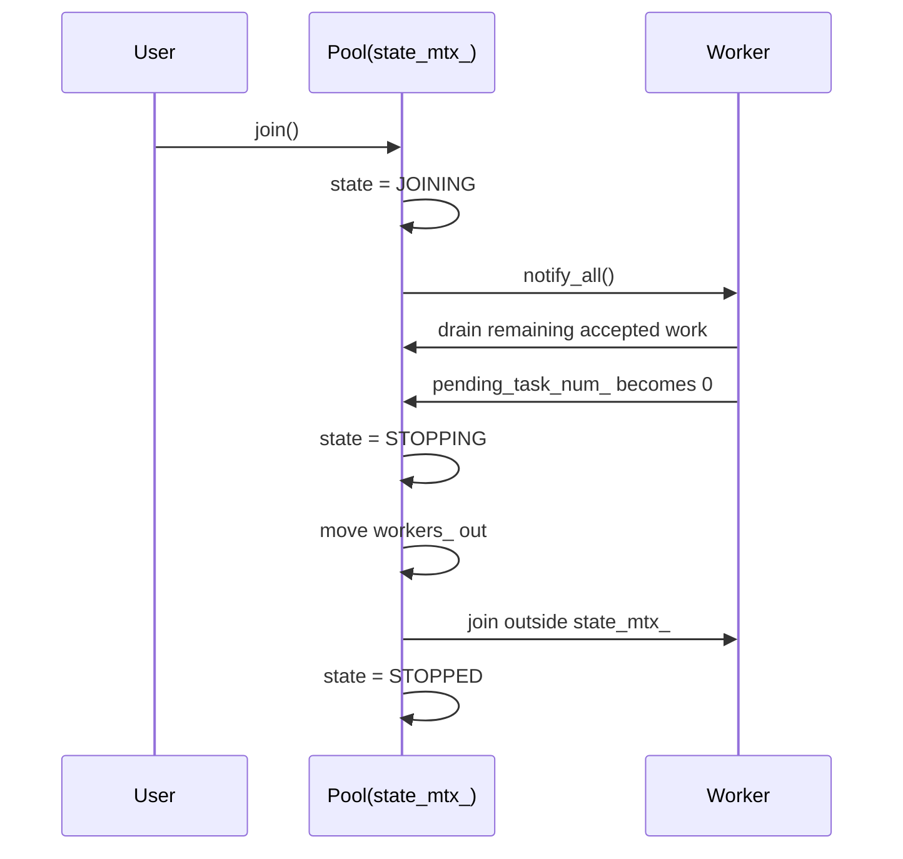
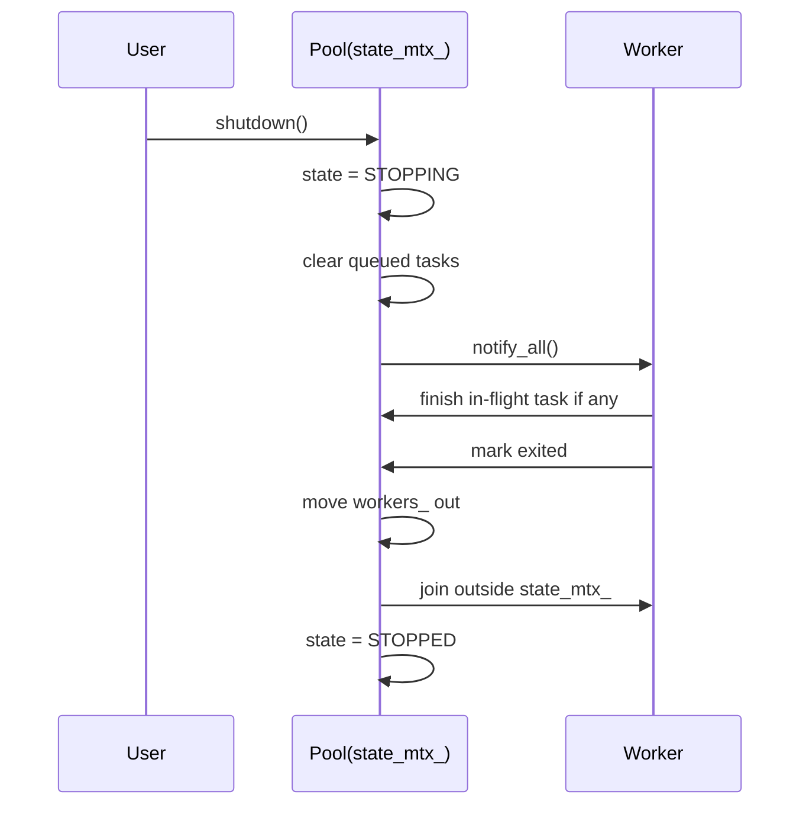

# bthpool

A lightweight, modern C++ thread pool focused on safety, simplicity, and performance. This README shows how to build, use, and understand the design of `bthpool`.

## Quick Start

### Build and run examples/tests

```zsh
# From project root
cmake -S . -B build -DCMAKE_BUILD_TYPE=Release -DBTHPOOL_BUILD_EXAMPLES=ON
cmake --build build -j

# Run examples
./build/examples/example_basic
./build/examples/example_advanced
./build/examples/example_concurrent
./build/examples/example_error_handling

# Run tests
ctest --test-dir build --output-on-failure
```

### Basic usage

```cpp
// Example: Minimal BThreadPool usage with a basic task and a future result.
// Use this pattern when you want a small, straightforward pool with graceful shutdown.

#include <bthpool/bthpool.hpp>
#include <iostream>

int main() {
    bthpool::BThreadPool<> pool;

    pool.post([] { std::cout << "hello from worker" << std::endl; });

    auto fut = pool.futured_post([](int a, int b) { return a + b; }, 2, 40);

    pool.join();

    std::cout << "sum: " << fut.get() << std::endl;
    return 0;
}
```

### Fire-and-forget tasks

```cpp
pool.post([] { /* do work without a return value */ });
```

## API Overview

- `BThreadPool<Allocator = std::allocator<std::byte>>`: Thread pool type templated by allocator.
- `BThreadPoolParam`: Configuration (e.g., `core_thread_num`, `max_thread_num`, `fast_queue_capacity`, `thread_clean_interval`).
- `BThreadPool()`, `BThreadPool(BThreadPoolParam, Allocator)`: Create a pool with default or custom parameters plus optional allocator.
- `post(F&&, Args&&...)`: Fire-and-forget submission; return values are discarded. Exceptions are ignored.
- `defer(F&&, Args&&...)`: Enqueue directly to the slow queue.
- `dispatch(F&&, Args&&...)`: Execute inline when called from a worker; otherwise enqueue.
- `futured_post(F&&, Args&&...) -> std::future<R>`: Submit a task and capture result/exception.
- `join()`: Graceful stop; waits for all queued tasks to finish.
- `shutdown()`: Immediate stop; queued tasks may be dropped.
- `restart()`: Transition from STOPPED back to RUNNING.

## Usage Examples

- [examples/example_basic.cpp](examples/example_basic.cpp): Minimal `BThreadPool` usage and a single `futured_post` result.
- [examples/example_advanced.cpp](examples/example_advanced.cpp): Parameter tuning plus mixed `post` and `defer` usage.
- [examples/example_concurrent.cpp](examples/example_concurrent.cpp): Multiple producer threads posting work concurrently.
- [examples/example_error_handling.cpp](examples/example_error_handling.cpp): Exception capture via `futured_post`.
- [examples/example.cpp](examples/example.cpp): Legacy demo retained for reference.

## Core Concepts

- `BThreadPoolParam` controls thread sizing and queue behavior. If `core_thread_num` is `0` (possible when `std::thread::hardware_concurrency()` returns `0`), set it explicitly.
- Use `BThreadPool<>` for default allocator behavior, or pass a custom allocator instance to the constructor when allocator tracking/routing is needed.
- `post` and `defer` discard return values; use `futured_post` to observe results or exceptions.
- `dispatch` may run inline when called from a pool worker, which can reduce scheduling overhead.

## Design Document

This section documents the current implementation, with emphasis on the two
things that matter most for correctness:

1. the order of lifecycle and bookkeeping operations
2. the observable behavior of the pool in each state

### Design Goals

- Keep the public API unchanged: `post`, `defer`, `dispatch`, `futured_post`, `join`, `shutdown`, `restart`, and executor compatibility all remain.
- Keep the dual-queue model: `post` prefers the fast queue and falls back to the slow queue; `defer` always uses the slow queue.
- Keep adaptive sizing: the pool grows toward `max_thread_num` under pressure and shrinks back toward `core_thread_num` when idle.
- Prioritize determinism over a partially lock-free lifecycle: queue visibility, worker sleep/wake, and stop-state transitions are serialized by one mutex/condition-variable pair.

### State Model

The pool has four states:

- `RUNNING`: accepts new tasks; workers execute tasks and may grow/shrink.
- `JOINING`: rejects new tasks; workers continue draining already accepted work.
- `STOPPING`: rejects new tasks; queued work is gone, workers only need to finish in-flight work and exit.
- `STOPPED`: fully quiesced; `restart()` may move the pool back to `RUNNING`.



### Core Data Model

- `state_mtx_` and `state_cv_` are the single source of truth for queue state, worker counts, and lifecycle state.
- `pending_task_num_` counts all accepted tasks that still exist in the system, including queued work and currently running work.
- `fast_queue_size_` and `slow_queue_size_` track visible queued work; they are updated under `state_mtx_`.
- `workers_` owns every worker object before the corresponding `std::thread` starts, and keeps ownership until a non-worker thread reaps or joins that worker.

This is the key design change relative to the older implementation: semaphore
permits, pending counters, and worker ownership are no longer advanced by
independent protocols.

### Submission Order

The submission path is intentionally ordered as follows:

1. Reap exited workers from earlier shrink/stop events.
2. Lock `state_mtx_`.
3. Reject the task if the pool is no longer `RUNNING`.
4. Decide whether to start a worker before accepting the task.
5. Increment `pending_task_num_`.
6. Push into the fast queue if possible, otherwise fall back to the slow queue.
7. `notify_one()` to wake exactly one sleeper.

That order matters:

- Starting a worker before accepting the task avoids the “task counted, but no worker can ever run it” failure mode if thread creation throws.
- Incrementing `pending_task_num_` before releasing the lock guarantees that `join()` sees every accepted task.
- Queue insertion and wake-up are performed under the same mutex-protected state, which removes the lost-notification and lost-permit windows that previously caused CI hangs.



### Worker Behavior

Workers always observe state under `state_mtx_` before choosing a behavior:

- If visible queued work exists, pop one task and execute it outside the lock.
- If the pool is `STOPPING`, mark the worker exited and return.
- If the pool is `JOINING`, do not accept new work; either drain already queued work or sleep until `pending_task_num_ == 0`.
- If the pool is `RUNNING` and the pool is above core size, perform a timed wait and retire on timeout.
- If the pool is `RUNNING` and the pool is at core size, wait indefinitely for work or a lifecycle transition.



### Lifecycle Order

#### `join()`

`join()` is graceful shutdown. Its order is:

1. Reap previously exited workers.
2. Serialize with other lifecycle methods via `lifecycle_mtx_`.
3. Under `state_mtx_`, move the pool from `RUNNING` to `JOINING`.
4. Wait until `pending_task_num_ == 0`.
5. Move the pool from `JOINING` to `STOPPING`.
6. Move all worker ownership out of `workers_`.
7. Join those workers outside `state_mtx_`.
8. Re-enter `state_mtx_` and mark the pool `STOPPED`.

The critical ordering rule is step 4 before step 6. If worker ownership were
moved out before the accepted-task count reached zero, a worker could still be
finishing its last task while the owner thread is already dismantling the
container that tracks it.



#### `shutdown()`

`shutdown()` is immediate stop. Its order is:

1. Reap previously exited workers.
2. Serialize with other lifecycle methods via `lifecycle_mtx_`.
3. Under `state_mtx_`, move the pool to `STOPPING`.
4. Drop queued-but-not-running work while still holding `state_mtx_`.
5. Wake all workers.
6. Move all worker ownership out of `workers_`.
7. Join those workers outside `state_mtx_`.
8. Re-enter `state_mtx_` and mark the pool `STOPPED`.

The critical ordering rule is step 3 before step 4. Once `STOPPING` is visible,
no new work can be accepted, so clearing queues cannot race with a producer
still claiming success on a just-submitted task.



### Behavior Summary

- `fast_queue_capacity == 0`: fast queue is disabled; `post()` goes straight to the slow queue, but forward progress is still guaranteed.
- `core_thread_num == 0`: the implementation still keeps an effective minimum of one worker, because otherwise accepted work could never make progress.
- `post()` after `join()`: silently dropped, matching existing tests.
- `futured_post()` after `join()`: returns a ready exceptional future, matching existing tests.
- `shutdown()` on queued futures: queued task wrappers are destroyed before execution; their promises therefore become ready with failure instead of hanging forever.
- `restart()`: only transitions `STOPPED -> RUNNING`; workers are recreated lazily by the next accepted submission.

### Why The New Design Fixes The Old Deadlocks

The previous failures came from mixing several partially independent mechanisms:

- queue visibility
- pending-task accounting
- worker ownership/cleanup
- stop/join wake-ups

The new design fixes that by making every ordering-sensitive transition pass
through the same mutex and the same condition variable. That means:

- an accepted task is always counted before it becomes visible to `join()`
- a worker is always owned before it starts
- a worker only reports “I am exited”; a non-worker thread performs the actual join
- lifecycle state changes and queue draining cannot observe half-applied bookkeeping

Source references: see `include/bthpool/bthpool.hpp` — `join()`, `shutdown()`,
`enqueue_task()`, `worker_loop()`, and the private state block near the end of
the class.

## Tips & FAQs

- Prefer `futured_post` when you need results or exceptions; use `post`/`defer` for side-effect-only work.
- If you need to throttle producers, consider adding a bounded queue or back-pressure.
- Avoid capturing large objects by copy in lambdas; use references or `std::shared_ptr`.
- If `std::thread::hardware_concurrency()` returns `0`, explicitly set `core_thread_num` in `BThreadPoolParam`.

## Build & Run Examples

```zsh
# Configure and build
cmake -S . -B build -DCMAKE_BUILD_TYPE=Release -DBTHPOOL_BUILD_EXAMPLES=ON
cmake --build build -j

# Run individual examples
./build/examples/example_basic
./build/examples/example_advanced
./build/examples/example_concurrent
./build/examples/example_error_handling
```

## Project Layout

- `include/bthpool/bthpool.hpp`: Public thread pool API.
- `include/bthpool/internal/safe_queue.hpp`: Thread-safe queue used by the pool.
- `examples/`: Example programs.
- `tests/`: Basic tests.
- `cmake/`: CMake config templates.
